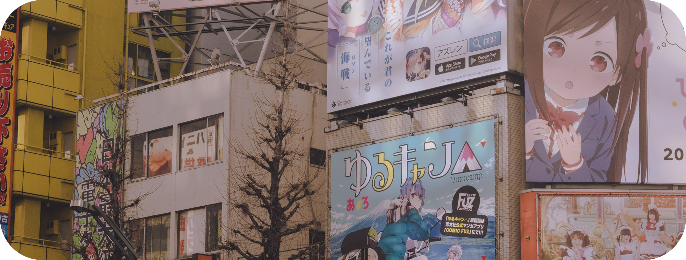

Photo by <a href="https://unsplash.com/@jaydeee?utm_source=unsplash&amp;utm_medium=referral&amp;utm_content=creditCopyText">jordan duca</a> on <a href="https://unsplash.com/s/photos/anime?utm_source=unsplash&amp;utm_medium=referral&amp;utm_content=creditCopyText">Unsplash</a>

  

<!--
**ArtichOwO/ArtichOwO** is a ✨ _special_ ✨ repository because its `README.md` (this file) appears on your GitHub profile.

Here are some ideas to get you started:

- 🔭 I’m currently working on ...
- 🌱 I’m currently learning ...
- 👯 I’m looking to collaborate on ...
- 🤔 I’m looking for help with ...
- 💬 Ask me about ...
- 📫 How to reach me: ...
- 😄 Pronouns: ...
- ⚡ Fun fact: ...
-->
